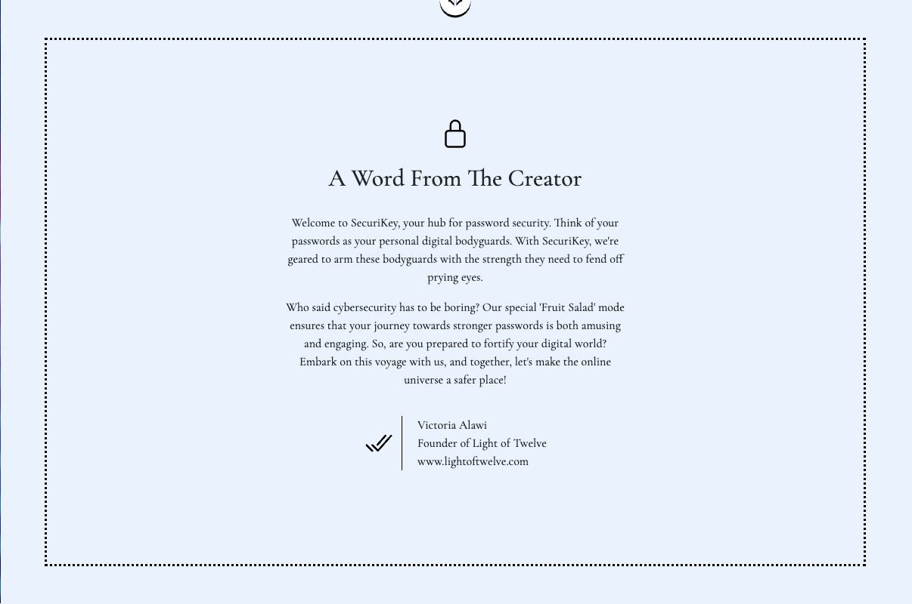
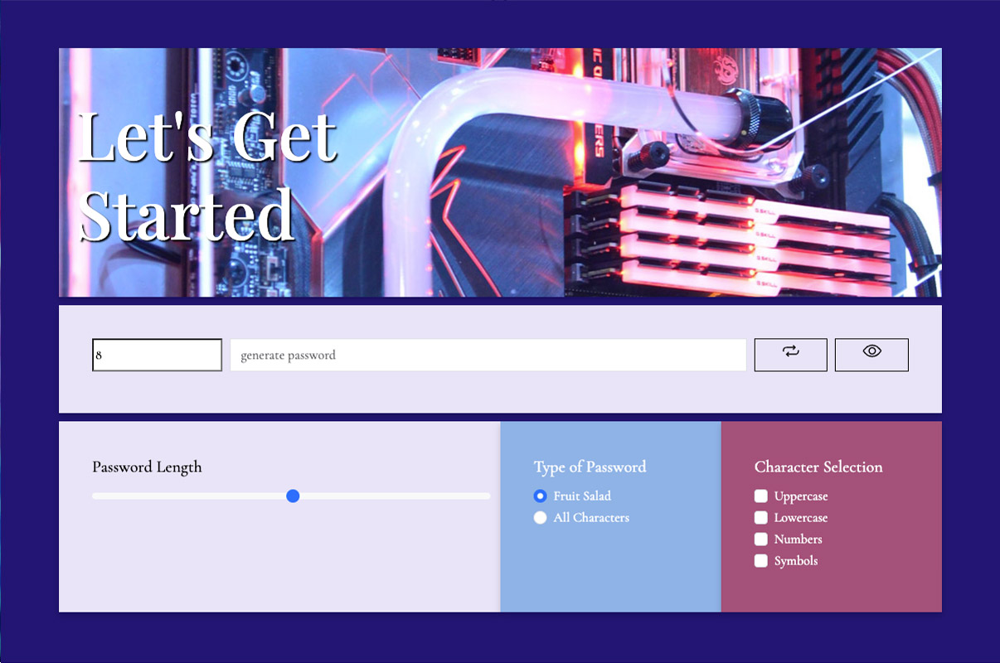

# SecuriKey Password Generator

## Overview
Welcome to SecuriKey, where we take your digital security seriously! Imagine having a master locksmith in your pocket, ever-ready to conjure up the most intricate and impenetrable keys - that's us but for your online world! 

Built with the dexterity of JavaScript, SecuriKey is a marvel that generates passwords as unique as your fingerprint. It lets you decide how secure you want your digital fortress to be. From length to complexity, you're in control. 

Fancy a 50-character long password humming with numbers, symbols, and a mix of lowercase and uppercase letters? SecuriKey will serve it up in a heartbeat. Or do you like a bit of whimsy? Our "Fruit Salad" option adds a dash of fun to your passwords, turning 'apple', 'kiwi', 'mango', and their friends into secret code language. But don't be fooled by the fun; these passwords are still as tough as they come! 

Our sleek HTML5 and CSS3 interface isn't just eye candy - it's thoughtfully designed to guide you smoothly through your password creation journey. No more fumbling through confusing controls or getting lost in translation. SecuriKey isn't just a tool; it's a revolution in safeguarding your online accounts. It's not just about creating passwords; it's about empowering you to take control of your online security, one password at a time. So join the revolution and turn the key to a more secure digital world!

## Features
- <b>Secure Password Generation</b>:
Generate highly secure and random passwords based on user-defined criteria.
Customize the length, character sets (uppercase letters, lowercase letters, numbers, symbols), and password type (fruit or character-based).
- <b>Fruit Mode</b>:
Option to generate passwords using a combination of fruit names, adding a touch of whimsy and memorability to the generated passwords.
- <b>Character Mode</b>:
Option to generate passwords using a combination of uppercase letters, lowercase letters, numbers, and symbols, providing a broader range of character sets for enhanced security.
- <b>Password Strength Indicator</b>:
Dynamically calculates and displays the strength of the generated passwords, helping users gauge the overall security level based on the selected character sets.
- <b>Easy-to-Use Interface</b>:
Sleek and intuitive HTML5 and CSS3 interface designed for a smooth user experience.
Responsive design ensures optimal viewing and usability across different devices.
- <b>Copy Password to Clipboard</b>:
Conveniently copy generated passwords to the clipboard with a single click, facilitating easy usage and storage.
- <b>Password Visibility Toggle</b>:
Toggle password visibility to check and verify the generated password while keeping it hidden from prying eyes.
- <b>Input Validation and Error Handling</b>:
Validate user input to ensure a suitable password length and at least one character set selection.
Display meaningful error messages when invalid input or incomplete criteria are detected.

## Usage Guide

- <b>Length</b>: Use the range slider or input field to select the desired length of your password. The length can be between 5 and 128 characters.
- <b>Character Sets</b>: Choose the character sets you want to include in your password:
    - <i>Uppercase Letters</i>: Select the checkbox to include uppercase letters (A-Z).
    - <i>Lowercase Letters</i>: Select the checkbox to include lowercase letters (a-z).
    - <i>Numbers</i>: Select the checkbox to include numbers (0-9).
    - <i>Symbols</i>: Select the checkbox to include symbols (!@#$%^&*()').
    - <b>Note</b>: At least one character set must be selected.
- <b>Password Type</b>: Choose the type of password you want to generate:
Fruit: Select the "Fruit" option to generate a password using a combination of fruit names.
Character: Select the "Character" option to generate a password using a random combination of selected characters.
- <b>Generate Password</b>: Click the "Generate Password" button to create your customized password based on the selected criteria.
- <b>View Password Strength</b>: The password strength is indicated below the input fields. It will display either "Weak," "Medium," "Strong," or "Very Strong" based on the number of selected character sets.
- <b>Reveal Password</b>: Click the eye icon next to the password field to toggle the visibility of the password. This allows you to check the password while it's hidden.
- <b>Generate Again</b>: To generate a new password with the same criteria, simply click the "Generate Password" button again.

## Screenshots

## Technologies Used
- HTML
- CSS
- JavaScript
- Bootstrap (CSS framework)
- Ionic Icons (Icon library)

## Live Demo
Check out the live version of this project [here](https://lightoftwelve.github.io/securikey-password-generator).

## Credits
This project was independently developed by Victoria Alawi.

- Github: [@lightoftwelve](https://github.com/lightoftwelve)
- LinkedIn: [@Victoria Alawi](https://www.linkedin.com/in/victoria-alawi-872984250/)
- Website: [www.lightoftwelve.com](http://www.lightoftwelve.com)

## Acknowledgements
I want to express my gratitude to my teacher, Sean Roshan, for their invaluable guidance and support in the structuring of this project.

## License
This project is not currently licensed.
